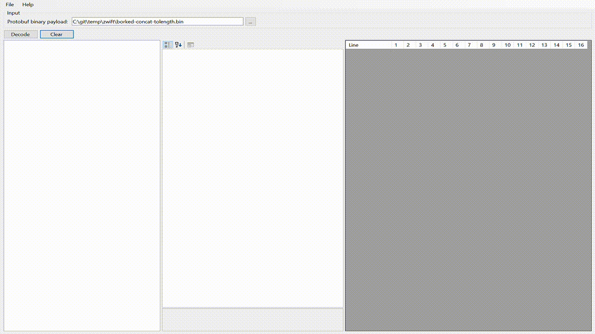

# ProtobufDecoder

This application helps with analyzing [Google Protocol Buffers](https://developers.google.com/protocol-buffers) payloads where you don't have a corresponding `.proto` file.

Scenarios where you might want to use this is to inspect the result of serialization or when you need to interoperate with a system talking Protobuf but which does not provide a `.proto` file. 
It can be used for _reverse engineering_ but bear in mind that this may not be legal in your jurisdiction.

## Features

- List fields in the captured payload and display information on:
  - Tag index
  - Wire type
  - Contents (raw bytes, values) 
- Display the location and size of a specific tag in the binary payload (select a tag in the tree view and it highlights the bytes)
- Generate a Protobuf spec from the decoded payload (work in progress)
- Save the generated Protobuf spec to a `.proto` file
- Copy the value of a tag as a C# byte array

## Todo

- [X] ~~Decode length-delimited tag values that could be strings, packed repeated values or embedded messages~~
- [ ] Generate `.proto` file from decoded payload
- [ ] Load a `.proto` file and apply it to the decoded payload (to verify the `.proto` file and payload match)
- [ ] Decode groups

## License

See [LICENSE](./LICENSE).

## Achknowledgements

This application uses:

- [topas/VarintBitConverter/](https://github.com/topas/VarintBitConverter/) for Varint decoding from the Protobuf payloads. (See [VarintValue](./src/ProtobufDecoder/VarintValue.cs))
- [WPF:HexEditor](https://github.com/abbaye/WPFHexEditorControl) to display the raw payload and tag highlighting
